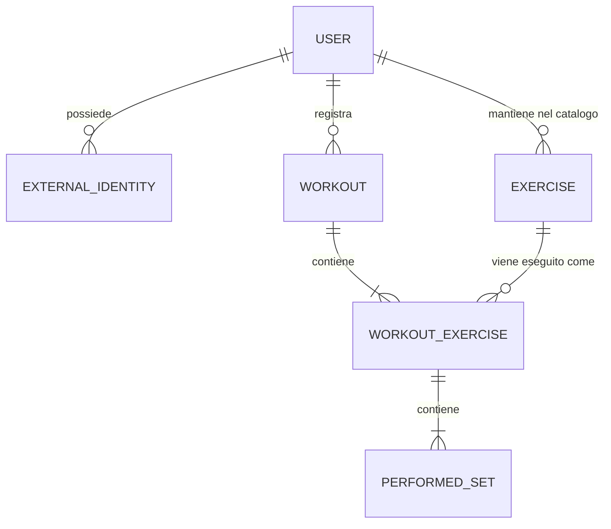

# Modello di dominio e schema del database

## 1. Scopo del documento

Questo documento descrive:

1. il modello di dominio complessivo del progetto;
2. il confine tra le funzionalita incluse nell'MVP e le possibili evoluzioni;
3. lo schema relazionale PostgreSQL dell'MVP;
4. le relazioni, i vincoli e gli indici principali.

Il database contiene dati applicativi strutturati. Il bot Telegram e il provider LLM sono adapter esterni: non fanno parte del dominio e non accedono direttamente al database.

## 2. Confine dell'MVP

### Incluso nell'MVP

- registrazione di un utente tramite identita Telegram;
- profilo utente con locale, timezone e unita di peso preferita;
- catalogo personale degli esercizi;
- invio al LLM del catalogo personale, composto da qualche decina di esercizi;
- creazione automatica di un esercizio sconosciuto;
- creazione incrementale di un workout, con uno o piu esercizi e i relativi set per messaggio;
- ciclo di vita esplicito `draft -> completed` e un solo draft attivo per utente;
- data del workout esplicita o relativa, con default alla data locale corrente;
- esercizi ordinati all'interno del workout;
- una riga persistita per ogni set eseguito;
- set basati sulle ripetizioni, con carico opzionale;
- pesi espressi in kg o lb e normalizzati in kg;
- note opzionali a livello di workout, esercizio eseguito e singolo set;
- validazione tecnica e applicativa del DTO restituito dal LLM;
- protezione dai doppi inserimenti tramite idempotency key;
- annullamento atomico dell'ultimo messaggio registrato nel draft;
- consultazione e cancellazione definitiva del draft attivo;
- storico workout e storico esercizio;
- record e statistiche calcolati dai dati normalizzati.

### Escluso dall'MVP

- persistenza dei messaggi, delle interazioni e delle risposte del LLM;
- conferma del workout prima del salvataggio;
- correzioni in linguaggio naturale diverse dall'annullamento dell'ultimo messaggio;
- modifica e revisione di un workout gia salvato;
- versionamento dei workout;
- annullamento logico dei workout;
- archiviazione, rinomina e unione degli esercizi;
- alias persistenti dei nomi degli esercizi;
- catalogo globale/canonico degli esercizi;
- set basati su durata, distanza, calorie, RPE o RIR;
- tabelle persistenti per record e statistiche;
- autenticazione della web application.

Queste esclusioni non eliminano la possibilita di aggiungere le funzionalita in seguito. Lo schema MVP mantiene identificatori e relazioni stabili che permettono migrazioni incrementali.

## 3. Modello di dominio

### 3.1 Aggregati e oggetti principali dell'MVP



### 3.2 User

`User` rappresenta la persona nel dominio, indipendentemente da Telegram o da futuri metodi di autenticazione.

Attributi principali:

- `locale`: lingua e convenzioni di presentazione; default `it-IT`;
- `timezone`: timezone IANA usata per interpretare date relative; default `Europe/Rome`;
- `preferred_load_unit`: unita usata quando il messaggio non specifica l'unita; default `kg`.

Precedenza per l'interpretazione del peso:

1. unita esplicita nel messaggio;
2. preferenza dell'utente;
3. default di sistema `kg`.

`locale` e `timezone` sono modificabili. La timezone viene validata dall'applicazione usando il database IANA disponibile tramite `zoneinfo`.

### 3.3 ExternalIdentity

`ExternalIdentity` collega un `User` a un'identita posseduta su una piattaforma esterna.

Per Telegram:

- `provider` vale `telegram`;
- `provider_subject` contiene il Telegram user ID stabile;
- username e display name sono solo informazioni descrittive e possono cambiare.

La coppia `(provider, provider_subject)` identifica univocamente una registrazione. Il dominio utente rimane cosi indipendente da Telegram e potra essere collegato in futuro a un'identita per la web application.

### 3.4 Exercise

`Exercise` rappresenta un esercizio stabile nel catalogo personale di un utente. Lo storico dei workout fa riferimento al suo ID e non al testo prodotto dal LLM.

Nell'MVP ogni esercizio possiede:

- un nome principale;
- un nome normalizzato, usato per confronti e unicita;
- il proprietario.

La normalizzazione viene eseguita dall'applicazione e comprende almeno:

- trim degli spazi iniziali e finali;
- conversione coerente tra maiuscole e minuscole;
- normalizzazione Unicode;
- riduzione degli spazi consecutivi.

Non sono presenti alias persistenti nell'MVP. Il catalogo personale, composto da ID e nomi principali, viene passato al LLM. Il LLM deve distinguere esplicitamente tra:

- riferimento a un esercizio esistente;
- proposta di un nuovo esercizio.

Un nuovo esercizio viene creato automaticamente nella stessa transazione che aggiunge la relativa occorrenza al workout. Prima della creazione, l'applicazione normalizza nuovamente il nome e verifica che non esista gia.

### 3.5 Workout

`Workout` e l'aggregate root della registrazione incrementale di un allenamento.

Contiene:

- l'utente proprietario;
- la data locale di esecuzione;
- eventuali note generali;
- lo stato `draft` o `completed`;
- la data e ora di registrazione nel sistema.

Un nuovo workout nasce `draft`, puo ricevere blocchi `WorkoutExercise` con almeno un set e diventa `completed` solo attraverso un comando esplicito. Ogni utente puo avere un solo draft attivo. I workout completati non sono modificabili nell'MVP e solo questi partecipano a history e statistiche.

`performed_on` e una `DATE`, non un timestamp. Rappresenta il giorno di esecuzione secondo la timezone dell'utente. `created_at` rappresenta invece il momento in cui il workout e stato salvato e puo essere successivo a `performed_on`.

Sono consentiti piu workout dello stesso utente nella stessa data.

### 3.6 WorkoutExercise

`WorkoutExercise` rappresenta una specifica occorrenza di un esercizio all'interno di un workout.

Non e solamente una tabella di associazione: conserva anche:

- la posizione dell'esercizio nel workout;
- eventuali note relative a quell'esecuzione.

Lo stesso esercizio puo comparire piu volte nello stesso workout. Non viene quindi imposto un vincolo di unicita su `(workout_id, exercise_id)`.

### 3.7 PerformedSet

`PerformedSet` rappresenta un singolo set realmente eseguito.

Ogni set contiene:

- numero progressivo nel relativo `WorkoutExercise`;
- numero di ripetizioni, obbligatorio e positivo;
- carico opzionale;
- eventuali note.

Una notazione compatta come `70x10x3` viene espansa in tre entita `PerformedSet`. Il formato compatto puo esistere nel messaggio o nel DTO intermedio, ma non e la rappresentazione persistita.

Il carico e un value object concettuale composto da:

- valore originale;
- unita originale (`kg` o `lb`);
- valore normalizzato in kg.

Se il carico non e presente, tutti i relativi campi sono null. Il valore zero e distinto da null: zero rappresenta un carico esplicitamente indicato, mentre null rappresenta un carico non specificato o non applicabile.

### 3.8 DTO e validazione

Il DTO restituito dal LLM non e un'entita persistente e non coincide con i modelli SQLAlchemy.

Per ogni esercizio il DTO utilizza concettualmente una discriminated union:

```json
{
  "kind": "existing",
  "exercise_id": "uuid"
}
```

oppure:

```json
{
  "kind": "new",
  "name": "Seal Row"
}
```

Il backend deve validare almeno:

- intent supportato;
- data valida;
- presenza di almeno un esercizio;
- presenza di almeno un set per esercizio;
- ripetizioni intere e positive;
- carico non negativo;
- unita supportata;
- appartenenza all'utente degli exercise ID restituiti;
- assenza di collisioni sui nomi normalizzati;
- coerenza dell'ordine di esercizi e set.

Il LLM non e considerato una fonte affidabile di ID, conversioni matematiche o regole di dominio. Il backend verifica gli ID e normalizza i pesi.

### 3.9 Idempotenza

Telegram puo inviare nuovamente lo stesso update quando non riceve una risposta valida o tempestiva. Ogni comando di scrittura contiene quindi una `idempotency_key` stabile derivata dall'evento esterno, per esempio:

```text
telegram:<bot>:update:<update_id>
```

La chiave e opaca per il dominio e non viene calcolata dal testo del messaggio. Due messaggi uguali inviati intenzionalmente devono poter produrre due workout differenti.

Il vincolo univoco sulla chiave garantisce che due elaborazioni dello stesso evento, anche concorrenti, non possano applicare due volte la stessa operazione. Se la chiave esiste gia con lo stesso utente, operazione e hash della richiesta, l'applicazione recupera la risorsa precedente e restituisce una risposta equivalente.

La chiave e memorizzata in `processed_command`, nella stessa transazione della modifica. Un riuso con utente, operazione o hash differenti produce un conflitto. Se la transazione fallisce, anche la claim viene annullata e la richiesta puo essere ritentata.

Le chiavi create prima dell'introduzione dell'hash vengono migrate come `legacy_create_workout`: non essendo ricostruibile il payload HTTP originale, un replay con la stessa chiave e lo stesso utente restituisce il workout storico senza applicare nuovamente il comando.

### 3.10 Record, statistiche e history

Workout history, exercise history, progressione e record sono proiezioni calcolate dalle tabelle normalizzate.

Nell'MVP non esistono entita o tabelle persistenti come `personal_record` o `exercise_statistics`. Questo evita problemi di sincronizzazione quando in futuro verranno introdotte modifiche o cancellazioni.

Esempi di proiezioni future:

- massimo carico per esercizio;
- massimo numero di ripetizioni a un dato carico;
- volume totale, calcolato come somma di `load_kg * repetitions`;
- estimated 1RM;
- andamento del carico o del volume nel tempo.

Le definizioni esatte dei record, in particolare la formula dell'estimated 1RM, sono decisioni applicative e non appartengono allo schema MVP.

## 4. Evoluzioni del dominio fuori dall'MVP

### 4.1 Interaction

Una futura entita `Interaction` potra memorizzare:

- messaggio ricevuto;
- intent e payload validato;
- versione dello schema del payload;
- stato dell'elaborazione;
- workout prodotto;
- collegamento all'interazione corretta o sostituita.

Servira per correzioni conversazionali, audit, debugging, retry complessi e analisi della qualita del LLM. Non viene introdotta nell'MVP perche non sono previste correzioni o persistenza del contesto conversazionale.

### 4.2 Correzione e versionamento

Una futura correzione potra operare sull'ultimo workout creato nella stessa conversazione, preferibilmente entro una finestra temporale configurabile calcolata su `created_at`.

In quel momento potranno essere aggiunti:

- `workout.revision` per optimistic locking e versionamento;
- `workout.updated_at`;
- collegamento tra interazione correttiva e workout;
- sostituzione transazionale dell'aggregate.

### 4.3 Archiviazione degli esercizi

`exercise.archived_at` potra rendere un esercizio non selezionabile per nuovi workout senza eliminare il suo storico. Gli esercizi gia referenziati non dovranno essere cancellati fisicamente.

### 4.4 Annullamento dei workout

Lo stato corrente distingue `draft` e `completed`. Una futura estensione con `voided` potra escludere un workout errato o duplicato da history e statistiche senza cancellarlo fisicamente.

### 4.5 Alias e catalogo canonico

Se il catalogo cresce, potra essere introdotta una tabella `exercise_name` per nomi principali e alias personali. Una futura entita `CanonicalExercise` potra collegare esercizi equivalenti tra utenti senza cambiare i riferimenti storici personali.

### 4.6 Tipi di set aggiuntivi

Durata, distanza, calorie, RPE, RIR, assisted load e altre metriche richiederanno un'estensione esplicita del modello. Nell'MVP non viene usato un modello EAV generico, perche renderebbe vincoli e query piu difficili senza un requisito attuale.

### 4.7 Autenticazione web

L'autenticazione della web application verra progettata successivamente. `User` rimane indipendente dal canale e `ExternalIdentity` permette di collegare in futuro una nuova identita allo stesso utente.

## 5. Schema relazionale PostgreSQL dell'MVP

### 5.1 Convenzioni generali

- identificatori: `UUID`;
- timestamp: `TIMESTAMPTZ`, memorizzati in UTC;
- date del dominio: `DATE`;
- nomi delle tabelle: singolare e `snake_case`;
- valori monetari o di misura decimali: `NUMERIC`, mai floating point;
- timestamp generati dal database o dall'applicazione con un'unica strategia coerente;
- tutti i testi obbligatori devono risultare non vuoti dopo il trim.

### 5.2 `app_user`

| Colonna | Tipo | Null | Default | Descrizione |
|---|---|---:|---|---|
| `id` | `UUID` | no | UUID generato | Identificatore interno |
| `locale` | `VARCHAR(16)` | no | `it-IT` | Locale supportato dall'applicazione |
| `timezone` | `VARCHAR(64)` | no | `Europe/Rome` | Timezone IANA |
| `preferred_load_unit` | `VARCHAR(2)` | no | `kg` | Unita implicita preferita |
| `created_at` | `TIMESTAMPTZ` | no | current timestamp | Creazione utente |
| `updated_at` | `TIMESTAMPTZ` | no | current timestamp | Ultima modifica profilo |

Vincoli:

- primary key su `id`;
- check `preferred_load_unit IN ('kg', 'lb')`;
- check sui testi non vuoti;
- validazione applicativa di `locale` rispetto ai locale supportati;
- validazione applicativa di `timezone` rispetto alle timezone IANA.

### 5.3 `external_identity`

| Colonna | Tipo | Null | Default | Descrizione |
|---|---|---:|---|---|
| `id` | `UUID` | no | UUID generato | Identificatore interno |
| `user_id` | `UUID` | no | - | Proprietario dell'identita |
| `provider` | `VARCHAR(32)` | no | - | Provider, inizialmente `telegram` |
| `provider_subject` | `VARCHAR(255)` | no | - | ID stabile dell'utente presso il provider |
| `username` | `VARCHAR(255)` | si | - | Username descrittivo e modificabile |
| `display_name` | `VARCHAR(255)` | si | - | Nome visualizzato |
| `created_at` | `TIMESTAMPTZ` | no | current timestamp | Momento del collegamento/registrazione |

Vincoli:

- primary key su `id`;
- foreign key `user_id -> app_user.id`;
- unique `(provider, provider_subject)`;
- check `provider` e `provider_subject` non vuoti.

Politica di cancellazione proposta: eliminazione in cascata quando viene eliminato esplicitamente l'account utente.

### 5.4 `exercise`

| Colonna | Tipo | Null | Default | Descrizione |
|---|---|---:|---|---|
| `id` | `UUID` | no | UUID generato | Identificatore dell'esercizio |
| `user_id` | `UUID` | no | - | Proprietario del catalogo |
| `name` | `VARCHAR(255)` | no | - | Nome principale visualizzato |
| `normalized_name` | `VARCHAR(255)` | no | - | Nome normalizzato per ricerca e unicita |
| `created_at` | `TIMESTAMPTZ` | no | current timestamp | Creazione nel catalogo |

Vincoli:

- primary key su `id`;
- foreign key `user_id -> app_user.id`;
- unique `(user_id, normalized_name)`;
- unique `(user_id, id)` per consentire foreign key composite di ownership;
- check `name` e `normalized_name` non vuoti.

Un esercizio referenziato da un workout usa `ON DELETE RESTRICT`. La cancellazione o archiviazione ordinaria non fa parte dell'MVP.

### 5.5 `workout`

| Colonna | Tipo | Null | Default | Descrizione |
|---|---|---:|---|---|
| `id` | `UUID` | no | UUID generato | Identificatore del workout |
| `user_id` | `UUID` | no | - | Proprietario |
| `performed_on` | `DATE` | no | - | Data locale dell'allenamento |
| `notes` | `TEXT` | si | - | Note generali |
| `status` | `VARCHAR(16)` | no | `draft` | Stato del workflow: `draft` o `completed` |
| `created_at` | `TIMESTAMPTZ` | no | current timestamp | Momento del salvataggio |
| `completed_at` | `TIMESTAMPTZ` | si | - | Momento del completamento esplicito |

Vincoli:

- primary key su `id`;
- foreign key `user_id -> app_user.id`;
- unique `(user_id, id)` per consentire foreign key composite di ownership;
- unique parziale su `user_id` quando `status = 'draft'`;
- check di coerenza: un draft non ha `completed_at`, un completed lo richiede;
- nessuna unicita su `(user_id, performed_on)`;
- eventuale divieto delle date future applicato dall'application service, non tramite check dipendente dalla data corrente.

Indice per la history:

```text
(user_id, status, performed_on DESC, created_at DESC, id DESC)
```

### 5.6 `workout_exercise`

| Colonna | Tipo | Null | Default | Descrizione |
|---|---|---:|---|---|
| `id` | `UUID` | no | UUID generato | Identificatore dell'occorrenza |
| `user_id` | `UUID` | no | - | Ownership ridondante e verificabile |
| `workout_id` | `UUID` | no | - | Workout contenitore |
| `exercise_id` | `UUID` | no | - | Esercizio del catalogo personale |
| `log_batch_id` | `UUID` | no | - | Identifica le occorrenze create dallo stesso messaggio |
| `position` | `SMALLINT` | no | - | Ordine nel workout |
| `notes` | `TEXT` | si | - | Note sull'esecuzione |

Vincoli:

- primary key su `id`;
- composite foreign key `(user_id, workout_id) -> workout(user_id, id)`;
- composite foreign key `(user_id, exercise_id) -> exercise(user_id, id)`;
- unique `(workout_id, position)`;
- unique `(user_id, id)` per la foreign key composite dei set;
- check `position > 0`;
- nessuna unicita su `(workout_id, exercise_id)`.

Indici:

```text
(user_id, exercise_id, workout_id)
(workout_id, log_batch_id)
(workout_id, position)
```

L'ultimo indice puo essere gia coperto dal vincolo univoco. La cancellazione
dell'ultimo batch rimuove soltanto le posizioni finali e non richiede rinumerazione.

### 5.7 `performed_set`

| Colonna | Tipo | Null | Default | Descrizione |
|---|---|---:|---|---|
| `id` | `UUID` | no | UUID generato | Identificatore del set |
| `user_id` | `UUID` | no | - | Ownership ridondante e verificabile |
| `workout_exercise_id` | `UUID` | no | - | Occorrenza dell'esercizio |
| `set_number` | `SMALLINT` | no | - | Numero progressivo del set |
| `repetitions` | `SMALLINT` | no | - | Ripetizioni eseguite |
| `load_value` | `NUMERIC(10,3)` | si | - | Valore originale inserito |
| `load_unit` | `VARCHAR(2)` | si | - | Unita originale: kg o lb |
| `load_kg` | `NUMERIC(12,6)` | si | - | Valore normalizzato per confronti e statistiche |
| `notes` | `TEXT` | si | - | Note sul singolo set |

Vincoli:

- primary key su `id`;
- composite foreign key `(user_id, workout_exercise_id) -> workout_exercise(user_id, id)`;
- unique `(workout_exercise_id, set_number)`;
- check `set_number > 0`;
- check `repetitions > 0`;
- check `load_unit IN ('kg', 'lb')` quando presente;
- check `load_value >= 0` e `load_kg >= 0` quando presenti;
- check: `load_value`, `load_unit` e `load_kg` sono tutti null oppure tutti valorizzati.

La conversione viene effettuata e validata dall'applicazione usando fattori deterministici. In alternativa, `load_kg` potra essere implementata come colonna PostgreSQL generated stored, eliminando il rischio che valore originale e valore normalizzato divergano.

Politica di cancellazione proposta: `ON DELETE CASCADE` da `workout_exercise` a `performed_set`, perche il set non esiste fuori dal proprio aggregate.

### 5.8 `processed_command`

| Colonna | Tipo | Null | Descrizione |
|---|---|---:|---|
| `idempotency_key` | `VARCHAR(255)` | no | Chiave opaca e globalmente univoca |
| `user_id` | `UUID` | no | Utente che ha emesso il comando |
| `operation` | `VARCHAR(64)` | no | Tipo di comando applicativo |
| `request_hash` | `VARCHAR(64)` | no | SHA-256 del comando canonico |
| `resource_id` | `UUID` | no | Risorsa restituita dal comando |
| `created_at` | `TIMESTAMPTZ` | no | Momento dell'elaborazione |

La tabella non usa una foreign key polimorfica su `resource_id`; la risorsa viene interpretata in base a `operation`. Record e modifica applicativa vengono sempre salvati nella stessa transazione.

## 6. Relazioni e politiche referenziali

| Padre | Figlio | Cardinalita | Politica proposta |
|---|---|---|---|
| `app_user` | `external_identity` | 1:N | cascade solo nella cancellazione esplicita dell'account |
| `app_user` | `exercise` | 1:N | gestione esplicita; esercizi referenziati non eliminabili |
| `app_user` | `workout` | 1:N | gestione esplicita dell'account |
| `workout` | `workout_exercise` | 1:N | cascade, perche e parte dell'aggregate |
| `exercise` | `workout_exercise` | 1:N | restrict, per preservare lo storico |
| `workout_exercise` | `performed_set` | 1:N | cascade, perche e parte dell'aggregate |

L'eliminazione di un account e un caso separato che dovra essere implementato come workflow applicativo esplicito e transazionale.

## 7. Invarianti transazionali

Ogni comando applicativo usa una transazione distinta e una Unit of Work condivisa dai repository:

1. la creazione inserisce un workout `draft` e impedisce un secondo draft dello stesso utente;
2. l'aggiunta blocca il workout, verifica stato e ownership, risolve o crea l'esercizio e salva insieme `WorkoutExercise` e tutti i `PerformedSet`;
3. il completamento blocca e valida l'aggregate prima della transizione a `completed`;
4. l'undo blocca il draft e cancella tutte le occorrenze dell'ultimo `log_batch_id`;
5. il cancel blocca e cancella il draft con occorrenze e set, ma non gli esercizi del catalogo;
6. la claim idempotente viene inserita nella stessa transazione della modifica;
7. il commit avviene soltanto quando l'intero comando e valido.

Se una qualsiasi operazione fallisce non rimangono blocchi parziali, esercizi orfani o claim idempotenti senza risultato. Modifiche concorrenti allo stesso workout sono serializzate con un lock sulla root; le collisioni sui nomi normalizzati usano il vincolo univoco e un upsert PostgreSQL.
